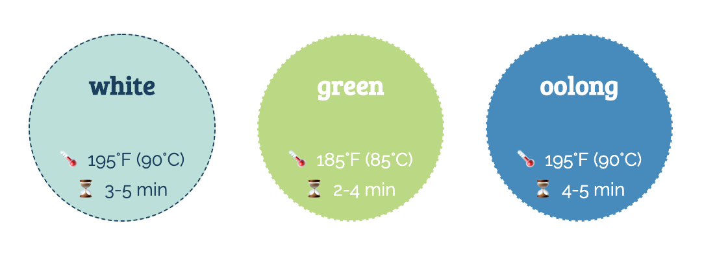

# Teamer

**Project:** [Teamer: Make the Perfect Cuppa](http://lisefrac.net/teamer/)

**Date:** Summer 2020

**Involvement:** Wholly designed and developed by me.

## Description

As a personal enrichment project, I decided to create a tea timing web application. This would allow you to select a type of tea (green, black, white, etc) which will automatically set a brewing time and display the brewing temperature. The user could then adjust the time up or down in increments of 10 seconds or 1 minute.  An alarm plays when the timer is done. 

Although simple to describe, the timing logic was not always easy to implement! Afterward, I wrote a more detailed post about what I learned about [measuring time in JavaScript](http://www.lisefrac.net/log/webdev-craft/til-in-javascript-timers/).

**Technologies:** HTML, CSS (including Flexbox), vanilla JavaScript. No images are used; just emoji, which are HTML entities. The tea buttons were created with a combination of `border-radius:50%` and the `padding-top` aspect ratio hack to maintain the same height and width despite Flexbox's... flexiness. 

**Status:** Live

## Potential improvements:
- Allow users the ability to add a tea, and store it using their local storage
- Use Sass or Stylus for CSS
- Visual effects - border that changes color? (per iOS timer)
- Accessibility -- right now this is probably gonna be unusable with a screen reader, or if you have a hearing/vision-related disability.

Caveat: since I haven't touched this since 2020, I'm unlikely to get to it any time soon!

## Local environment

Since it's all flat HTML/CSS/JS files, it's really simple to "run" this locally! Either `git clone` the repo, or download and unzip the files, whichever you prefer. You can then open up `index.html` in your browser.

## Additional Notes

Right now this is deployed as flat files FTPed to hosting space (i.e. not from this repo!) Might set up as a Netlify site (or similar) for build/deploy/hosting in the future, but probably not until I move my blog to a static site generator.

## Images

*Screenshot of Teamer as it appears when you first visit the site. A series of colored buttons lists the different types of teas, along with the suggested brewing times and temperatures. A timer is below it, with buttons to increment/decrement the timer, stop, and play/pause.*

*Closeup on the tea buttons. Each button displays the ideal brewing time as a range, and the suggested brewing temperature in Fahrenheit and Celsius.*

*Closeup on just the timer portion of Teamer. The timer is set to 00:00. To the left, there are up/down buttons to increment/decrement the time by 1 minute (title on hover); to the right, there are up/down buttons to increment/decrement by 10 seconds. Below it are a Play/Pause button and a Stop button.*
